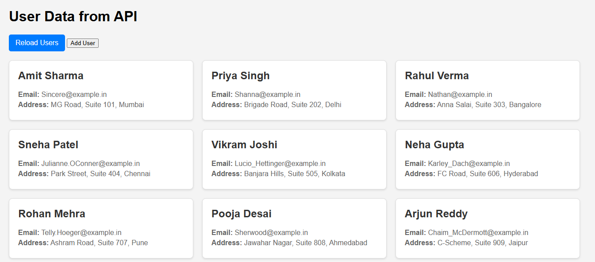

# User Data from API

This project displays user data fetched from a public API, but with all details (names, addresses, cities, and emails) converted to Indian-style information.  
You can also add your own users using the **Add User** option.

## Features

- Fetches user data from [JSONPlaceholder](https://jsonplaceholder.typicode.com/users)
- Displays Indian names, addresses, and email domains
- **Add User** button lets you add custom users with Indian details
- Reload users from API with the **Reload Users** button
- Responsive and clean UI

## How to Use

1. Clone or download this repository.
2. Open `index.html` in your browser.
3. Click **Reload Users** to fetch and display Indianized user data.
4. Click **Add User** to open the form and add your own user. Fill in the details and click **Submit**.

## Files

- `index.html` – Main HTML file
- `style.css` – Styles for the UI
- `script.js` – JavaScript logic for fetching, displaying, and adding users

## Screenshot

